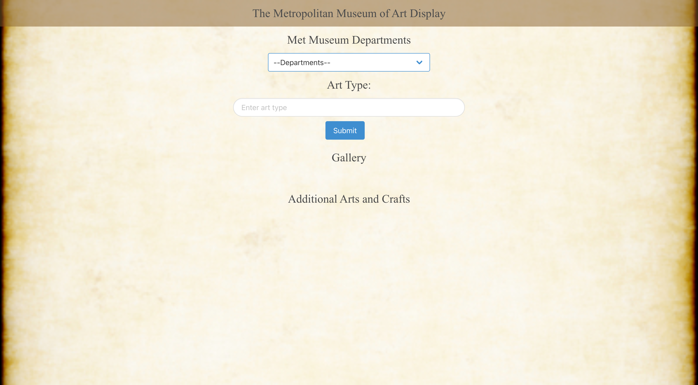

#  Metropolitan Museum Art Collection

## Description 

    The webpage was designed to inspect the Metropolitican Museum Art Collection. Users are able to navigate though the various departments that is within the Museum gallery. Only items with images will be displayed. All the information obtained is credited due to the Metropolitan Museum Api. Users can additionally type a one word topic of interest into the search result to generate five random art collections contained within the api. 

## Visuals

## Installation

    None required
## Usage

    Browse through the Metropolitian Museum Collections! Users can browse via dropdown by opting though departments or generate five random arts based on the search input.
## Roadmap

    Contain the grid better. Increase column count. Decrease image width on bigger screens. Implement more functions and access more information within the api. 

## Authors and acknowledgement

Justin Dong and Sam Watson

## Resources
